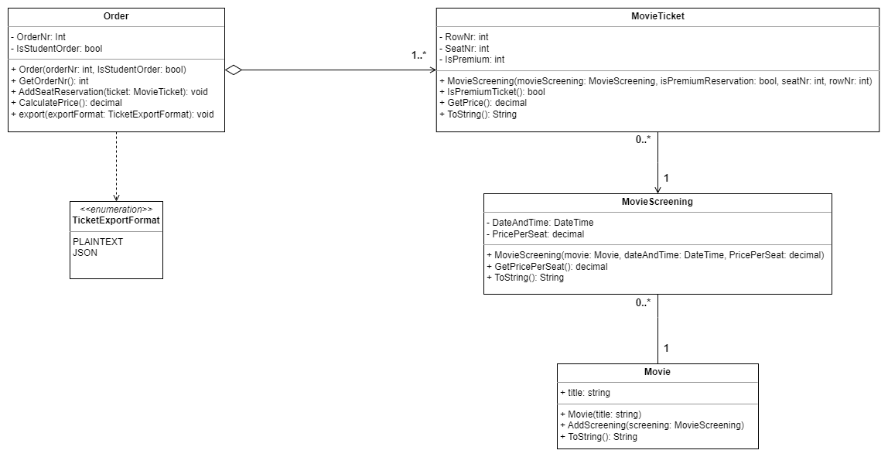
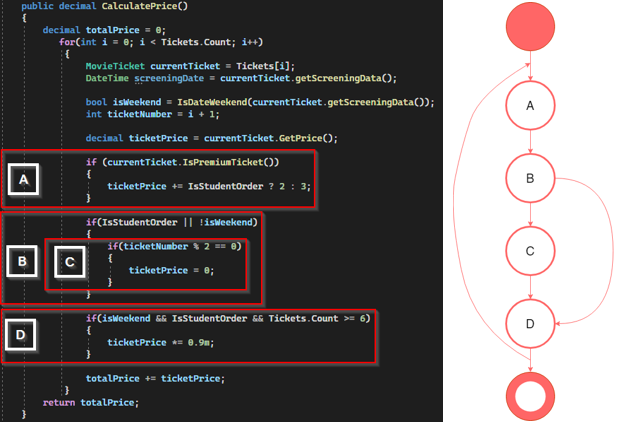

# Bioscoopcasus (Sybrand Bos en Tristan Goossens)
> Voorbeeld casusopdracht over een bioscoopsysteem die tijdens ontwikkeling we stap voor stap een steeds complexer wordt.
> Deze applicatie is gemaakt voor het vak  Softwareontwerp & -architectuur 3 en dient als oefenopdracht.

## De Basis
De basis van de applicatie is een domein die de modellen van de applicatie bevat. Deze bevatten enkele logica bijvoorbeeld voor het berekenen van de prijs van een bestelling.

## Testen 
Het testen van de code word gedaan met behulp van xUnit unit testen en de code quality controles van SonarCloud. De testcases zijnj opgesteld aan de hand van een begrip voor alle mogelijke paden die een algoritme kan aflopen (TMAP)

